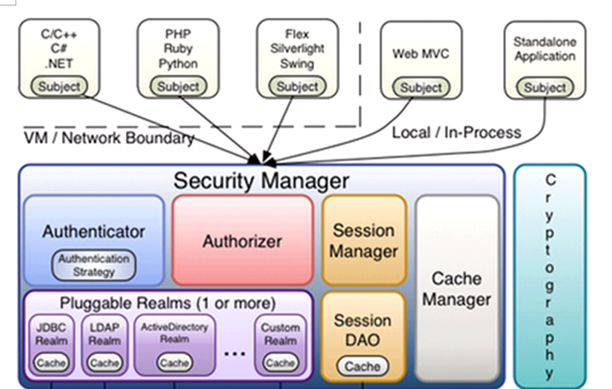

### 介绍
Shiro 是一个功能强大且易于使用的 Java 安全框架，它提供了身份验证、授权、会话管理、加密、RememberMe等功能。
#### 组成

- subject：主体，可以是用户也可以是程序，主体要访问系统，系统需要对主体进行认证、授权。认证主体包含两个信息
  - Principals:身份,即用户名
  - Credentials:凭证,即密码
- securityManager： 是 Shiro 的心脏；所有具体的交互都通过 SecurityManager 进行拦截并控制；它管理着所有 Subject、且负责进行认证和授权、及会话、缓存的管理
- authenticator：认证器，负责主体认证的，即确定用户是否登录成功，我们可以使用　 Shiro 提供的方法来认证，也可以自定义去实现，自己判断什么时候算是用户登录成功
- authorizer：授权器，即权限授权，给　Subject 分配权限，以此很好的控制用户可访问的资源
- sessionManager：为了可以在不同的环境下使用　session 功能，shiro 实现了自己的 sessionManager ，可以用在非 web 环境下和分布式环境下使用，\
web应用中一般是用web容器对session进行管理，shiro也提供一套session管理的方式。可以实现单点登录。
- SessionDao： 通过SessionDao管理session数据，针对个性化的session数据存储需要使用sessionDao。
- cache Manager：缓存管理器，主要对session和授权数据进行缓存，比如将授权数据通过cacheManager进行缓存管理，和ehcache整合对缓存数据进行管理。
- realm：域，领域，相当于数据源，通过realm存取认证、授权相关数据。（它的主要目的是与数据库打交道，查询数据库中的认证的信息（比如用户名和密码），查询授权的信息（比如权限的code等，所以这里可以理解为调用数据库查询一系列的信息，一般情况下在项目中采用自定义的realm，因为不同的业务需求不一样））
- cryptography：密码管理，提供了一套加密/解密的组件，方便开发。比如提供常用的散列、加/解密等功能。

#### 和spring security的比较
spring中有spring security (原名Acegi)，是一个权限框架，它和spring依赖过于紧密，没有shiro使用简单。\
shiro不依赖于spring，shiro不仅可以实现 web应用的权限管理，还可以实现c/s系统，分布式系统权限管理，shiro属于轻量框架，越来越多企业项目开始使用shiro。

#### 身份认证流程
1. 首先调用 Subject.login(token)进行登录,其会自动委托给 SecurityManager（Securitymanager负责真正的身份验证逻辑，可通过 SecurityUtils.setsecuritymanager设置）
2. Securitymanager最终会委托给 Authenticator进行身份验证，Authenticator可能会委托给相应的 AuthenticationStrategy进行多 Realm身份验证,\
默认Modularrealmauthenticator会调用 AuthenticationStrategy进行多Realm身份验证;
3. Authenticator会把相应的 token传入 Realm,从 Realm获取身份验证信息,如果(没有返回/抛出异常/Realm返回用户密码和token中的密码不一致)表示身份验证失败了。\
此处可以配置多个 Realm,将按照相应的顺序及策略进行访问。

#### 授权原理
1. 对subject进行授权，调用方法isPermitted（“permission串”）
2. SecurityManager执行授权，通过ModularRealmAuthorizer执行授权
3. ModularRealmAuthorizer执行realm（自定义的CustomRealm）从数据库查询权限数据 调用realm的授权方法：doGetAuthorizationInfo
4. realm从数据库查询权限数据，返回ModularRealmAuthorizer
5. ModularRealmAuthorizer调用PermissionResolver进行权限串比对
6. 如果比对后，isPermitted中"permission串"在realm查询到权限数据中，说明用户访问permission串有权限，否则 没有权限，抛出异常。

### 分析
#### 身份认证后：怎么保证SecurityUtils.getSubject()获取到上次的认证信息
org.apache.shiro.mgt.DefaultSecurityManager.createSubject(org.apache.shiro.subject.SubjectContext)

### 官网
https://shiro.apache.org/

